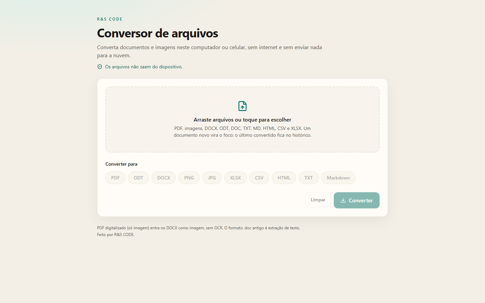

# Conversor de Arquivos Offline

Offline file converter for **Windows** and **Android**. Files never leave the device.

Feito por **R&S CODE**. Conversões 100% no aparelho: PDF, imagens, DOCX, ODT, planilhas e texto. Sem conta, sem servidor, sem nuvem.

[](https://github.com/rscodephb/conversor-arquivos/actions/workflows/ci.yml)
[](https://github.com/rscodephb/conversor-arquivos/releases/latest)
[](LICENSE)



**[Baixar Windows e Android](https://github.com/rscodephb/conversor-arquivos/releases/latest)**

No Windows use o instalador `.exe`. No Android instale o `.apk` (sideload). Os arquivos oficiais estão na página de Releases.

## Conversões

| Origem | Destino | Qualidade |
|---|---|---|
| PNG, JPG, WEBP, BMP | PDF (um arquivo ou várias imagens juntas) | Alta |
| PDF | PNG / JPG (uma imagem por página) | Alta |
| Vários PDFs | PDF unificado | Alta |
| DOCX / ODT | PDF, DOCX, ODT, HTML, TXT, MD | Boa para texto, listas, tabelas simples e imagens |
| PDF | DOCX / ODT | Aproximada: texto + imagens; o layout não é 1:1 |
| DOC antigo | PDF / DOCX | Extração de texto |
| TXT, MD, HTML | PDF, DOCX, ODT, HTML, TXT, MD | Alta |
| CSV ↔ XLSX | e PDF | Alta / tabela paginada |

PDF digitalizado (só imagem) entra no Word como imagem. Esta versão não tem OCR.

## Arquitetura

O app é [Tauri 2](https://tauri.app/) + React + TypeScript. O Rust abre a janela, o disco e o empacotamento (NSIS no Windows, APK no Android). As conversões rodam no WebView, neste dispositivo, com `pdf-lib`, PDF.js, mammoth, docx e JSZip.

Não há LibreOffice embutido: documentos com layout complexo são simplificados de propósito. A interface avisa a fidelidade de cada destino.

## Desenvolvimento

```bash
npm run setup
npm test
npm run tauri:dev
```

`npm run setup` instala dependências JavaScript, Rust e, se possível, as Build Tools C++ e o NDK. É preciso ter [Node.js](https://nodejs.org/) 20+ antes. A UI também abre no navegador em `http://localhost:1420` com `npm run dev`.

Build Windows (instalador NSIS, WebView2 embutido):

```bash
npm run tauri:build
```

Build Android (primeira vez: `npm run android:init`):

```bash
npm run android:build
```

Detalhes de SDK, APK e publicação: [docs/dev.md](docs/dev.md). Como contribuir: [CONTRIBUTING.md](CONTRIBUTING.md).

## Licença

MIT. Ver [LICENSE](LICENSE).

© R&S CODE
